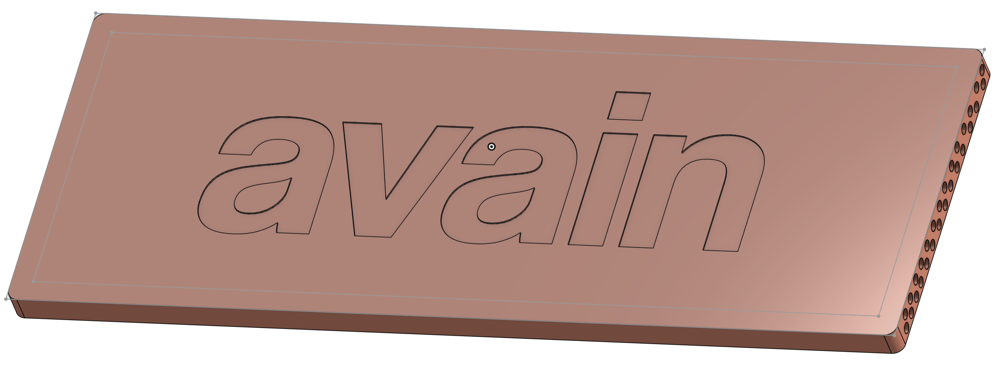
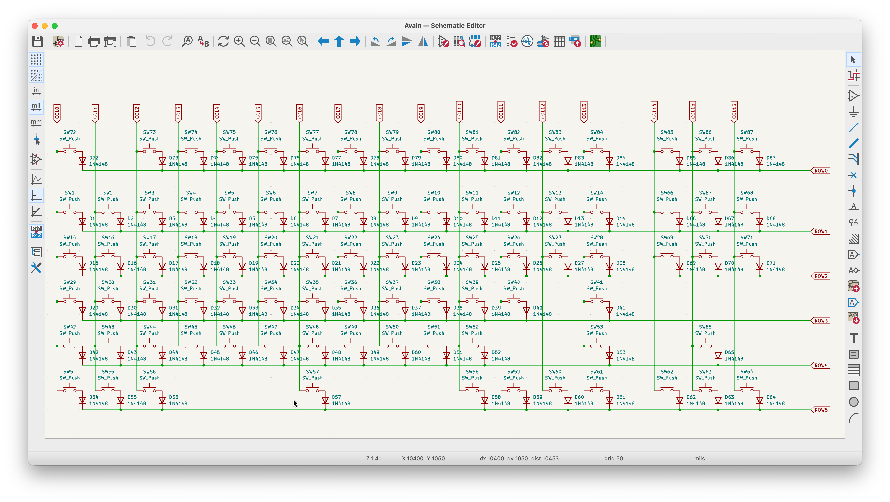
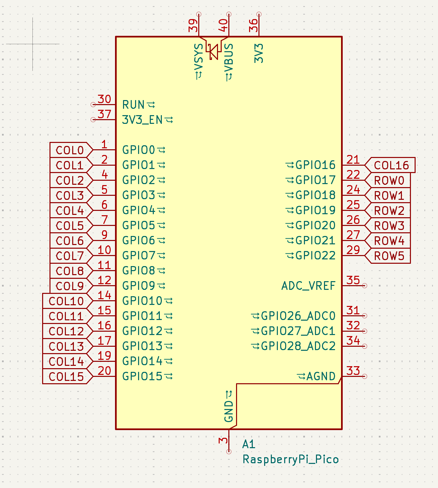
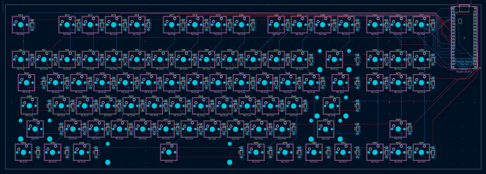
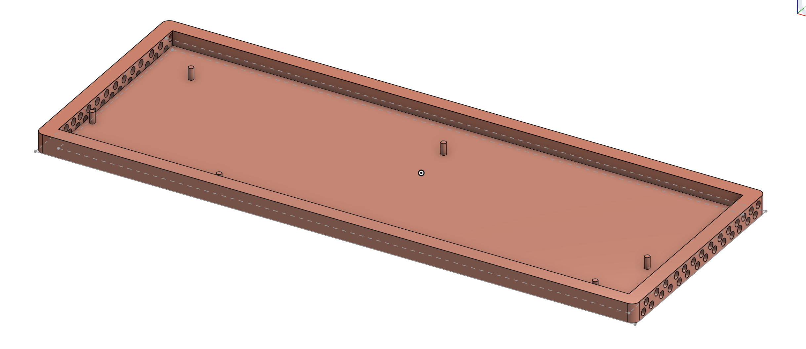
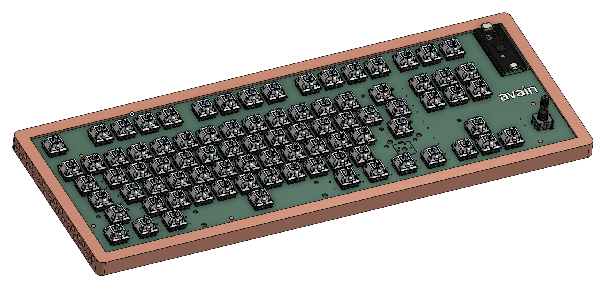
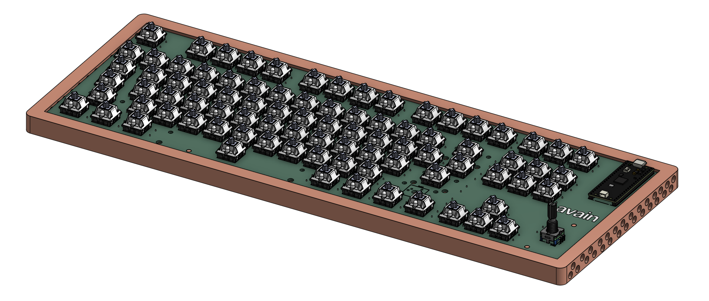

# Avain

### Why did I make it?
No specific reason tbh. But, another keyboard I made ([Clavis](https://github.com/rudranshgoel1/clavis)) was a 60%, I lowk wanted an 80% keyboard so I made it.

### What was the hardest part about this ?
Hardest part was actually finding time to make this.

Features:

- RotaryEncoder for Volume Control
- 87 keys (Base + Fn keys + arrow keys + 6 extra keys for home/pg up down and other)
- Raspberry Pi Pico
- Customised layout
- KMK firmware
- Avain Branded PCB
- Custom case

### Schematic

### PCB 

### Case

- Side

I made some aesthetic for Avain. Like I have added holes on all the sides to make it look more good

### 3D view of all parts 

link to full 3d thing-
https://cad.onshape.com/documents/6774359217ff8c97b90facb7/w/2137304fb52ca582983570b9/e/130904d3ca2552892ee4c097?renderMode=0&uiState=69ea524ad3ddea9c2c06a244

A special thanks to Anay and Aditya ( once again ) who are helping me still to make my projects better. Love them so much!

|Name                                                         |Purpose                         |Quantity|Total Cost (INR)|Total Cost (USD)|Link                                                                             |Distributor   |
|-------------------------------------------------------------|--------------------------------|--------|----------------|----------------|---------------------------------------------------------------------------------|--------------|
|Akko Creamy Cyan Switch                                      |Switches for the keyboard       |87      |₹2,598.00       |$28.06          |https://stackskb.com/store/akko-creamy-cyan-switch-pack-of-45-pre-order/         |StacksKB      |
|Black Gray Yellow Cherry Doubleshot PBT Keycaps              |Keycaps for the keyboard        |1       |₹1,399.00       |$15.11          |https://curiositycaps.in/products/black-gray-yellow-cherry-doubleshot-pbt-keycaps|Curiosity Caps|
|Durock Smokey Screw-In Stabilizers V2 (4+1 w/ 6.25u spacebar)|Stabilizers for longer keys     |1       |₹1,595.00       |$17.22          |https://stackskb.com/store/durock-smokey-screw-in-stabilizers-v2/                |StacksKB      |
|EC11 10K Rotary Encoder                                      |RotaryEncoder for Volume Control|1       |N/A             |N/A             |Self Sourced                                                                     |Amazon        |
|Raspberry Pi Pico                                            |MCU for the keyboard            |1       |₹599.00         |$6.47           |https://www.amazon.in/gp/product/B08WPNM7JB                                      |Amazon        |
|1N4148 Diodes                                                |Diodes for the switches         |1       |₹149.00         |$1.61           |https://www.amazon.in/gp/product/B084ZP5BJ3                                      |Amazon        |
|PCB                                                          |Main PCB of the keyboard        |5       |₹4,474.51       |$47.49          |https://jlcpcb.com/                                                              |JLCPCB        |
|M3 x 8mm Bolt                                                |Screws                          |10      |₹210.00         |$2.27           |https://www.amazon.in/dp/B07X8PHXKB                                              |Amazon        |
|M3 Nuts                                                      |Screws                          |12      |₹74.00          |$0.80           |https://www.amazon.in/dp/B09J92WY5Q                                              |Amazon        |
|M3 x 5mm Heatset Insert                                      |Screws                          |25      |₹196.00         |$2.12           |https://www.amazon.in/dp/B0CX1BS7DJ                                              |Amazon        |
|Case                                                         |Case for the keyboard           |1       |₹500.00         |$5.40           |Print Legion                                                                     |Print Legion  |
|                                                             |                                |        |                |                |                                                                                 |              |
|                                                             |                                |        |                |                |                                                                                 |              |
|                                                             |                                |        |₹11,794.51      |126.55          |                                                                                 |              |

## Shipping
Amazon + StacksKB = ~$3
Printing Legion = ~$5

Total Shipping = $8

## Total Pricing
The total price comes out to be 11,800 INR ($126.55)
Total Shipping = $8

Price After Shipping - 12,550 INR ($134.55)

The pricing might slightly vary due to flash sales, and dollar market trends.